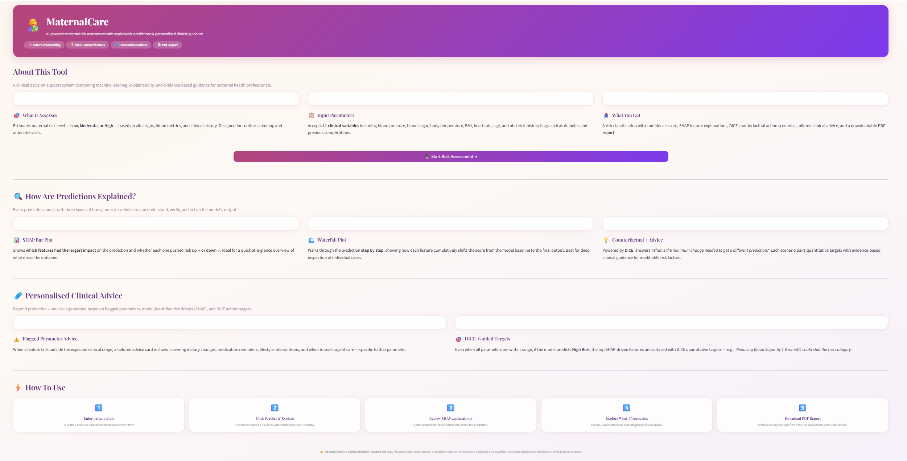
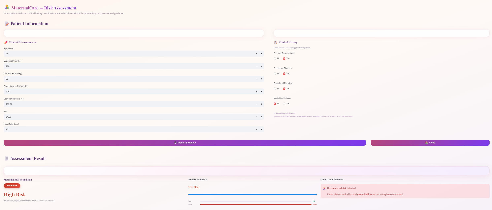
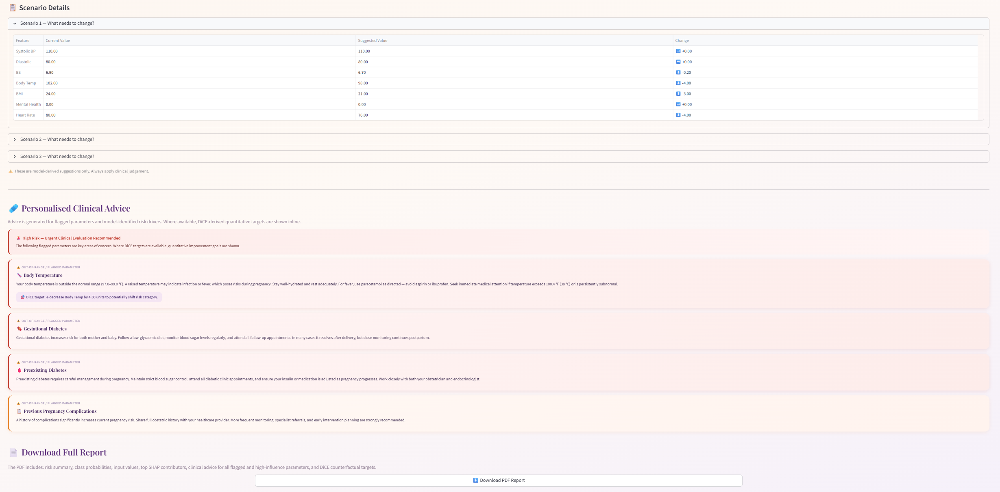

# 🤱 MaternalCare — AI-Powered Maternal Risk Assessment


**MaternalCare** is a clinical decision-support web application that uses machine learning to assess maternal health risk. It combines a trained classifier with three layers of explainability — DiCE counterfactuals, SHAP feature attribution, and evidence-based clinical advice — to help healthcare professionals understand, verify, and act on predictions.

> ⚠️ This tool is a **clinical decision-support aid only**. All predictions and advice must be reviewed and validated by a qualified healthcare professional before any clinical action is taken.

---

## 📸 Screenshots

| Home | Assessment | DiCE & Advice |
|------|------------|---------------|
|  |  |  |

---

## ✨ Features

- **Risk Classification** — Predicts maternal risk as Low, Moderate, or High with a confidence score and per-class probability breakdown
- **DiCE Counterfactuals** — Generates "what-if" scenarios showing the minimum changes to modifiable features that would shift the risk classification; skipped automatically for Low Risk predictions
- **SHAP Explanations** — Bar plot and waterfall plot showing which features drove the prediction and by how much
- **Personalised Clinical Advice** — Evidence-based advice cards shown only for parameters that are genuinely flagged (outside normal range or patient-reported flags); never shown for clean Low Risk patients
- **PDF Report** — Downloadable A4 report including risk summary, class probabilities, input values, SHAP contributors, clinical advice, and DiCE targets
- **Single-page app** — No sidebar navigation; clean home → assessment flow

---

## 🏗️ Project Structure

```
MaternalCare/
│
├── app.py                  # Entry point — Streamlit app routing
├── home_page.py            # Home / landing page
├── general_model_page.py   # Assessment form, results, SHAP, DiCE, PDF
├── utils.py                # All shared logic: model loading, SHAP, DiCE,
│                           #   advice rendering, PDF generation, CSS
│
├── model-d3.pkl            # Trained classifier (scikit-learn)
├── train_df-d3.pkl         # Training DataFrame (used by DiCE for permitted ranges)
│
├── requirements.txt        # Python dependencies
├── Home.png                # Screenshot — home page
├── General_Model.png       # Screenshot — assessment page
├── Clinical_Model.png      # Screenshot — DiCE & advice tab
├── Waterfall.png           # Screenshot — waterfall plot
├── PDF Report.png          # Screenshot — PDF report
└── README.md
```

---

## 🧠 Input Features

| Feature | Type | Description |
|---|---|---|
| Age | Continuous | Patient age in years |
| Systolic BP | Continuous | Systolic blood pressure (mmHg) |
| Diastolic | Continuous | Diastolic blood pressure (mmHg) |
| BS | Continuous | Blood sugar level (mmol/L) |
| Body Temp | Continuous | Body temperature (°F) |
| BMI | Continuous | Body mass index |
| Heart Rate | Continuous | Resting heart rate (bpm) |
| Previous Complications | Binary | History of pregnancy complications (Yes/No) |
| Preexisting Diabetes | Binary | Diagnosed diabetes before pregnancy (Yes/No) |
| Gestational Diabetes | Binary | Diabetes developed during pregnancy (Yes/No) |
| Mental Health | Binary | Active mental health condition (Yes/No) |

---

## 📐 Normal Ranges Used for Flagging

| Feature | Normal Range |
|---|---|
| Systolic BP | 90 – 140 mmHg |
| Diastolic BP | 60 – 90 mmHg |
| Blood Sugar | 3.9 – 7.8 mmol/L |
| Body Temperature | 97.0 – 99.0 °F |
| BMI | 18.5 – 29.9 |
| Heart Rate | 60 – 90 bpm |
| Binary flags | Flagged when = 1 (Yes) |

---

## 🔍 Explainability Design

### 1 · DiCE Counterfactuals (Tab 1 — default)
Uses the [DiCE](https://github.com/interpretml/DiCE) library to generate alternative scenarios. Only **modifiable** features are varied (`Systolic BP`, `Diastolic`, `BS`, `Body Temp`, `BMI`, `Mental Health`, `Heart Rate`). Permitted ranges are derived from the training data distribution. DiCE is **not triggered for Low Risk** predictions — an informational message is shown instead.

### 2 · SHAP Bar Plot (Tab 2)
Uses `shap.TreeExplainer` to compute feature-level contributions. Red bars push risk up, green bars push risk down. The top 3 drivers are summarised in plain English above the chart.

### 3 · SHAP Waterfall Plot (Tab 3)
Shows the cumulative step-by-step shift from the model baseline `E[f(x)]` to the final prediction `f(x)`, one feature at a time.

### Clinical Advice Logic
Advice cards are shown **strictly** based on patient input:
- Features outside their normal range → advice shown
- Binary flags set to Yes (e.g. Preexisting Diabetes) → advice shown
- Low Risk + all values normal → no advice shown (clean all-clear message)
- SHAP-driven fallback is **intentionally excluded** to avoid surfacing phantom advice for clinically normal patients

---

## 🚀 Getting Started

### Prerequisites
- Python 3.9 or higher
- pip

### Installation

```bash
# 1. Clone the repository
git clone https://github.com/your-username/maternalcare.git
cd maternalcare

# 2. Create and activate a virtual environment (recommended)
python -m venv venv
source venv/bin/activate        # macOS / Linux
venv\Scripts\activate           # Windows

# 3. Install dependencies
pip install -r requirements.txt

# 4. Run the app
streamlit run app.py
```

The app will open at `http://localhost:8501` in your browser.

### Required Files
Make sure the following model files are in the project root before running:

| File | Description |
|---|---|
| `model-d3.pkl` | Trained scikit-learn classifier |
| `train_df-d3.pkl` | Training DataFrame with feature columns and `Risk Level` target |

---

## 📦 Dependencies

```
streamlit
numpy
pandas
scikit-learn
shap
dice-ml
matplotlib
reportlab
```

Install all at once:
```bash
pip install -r requirements.txt
```

---

## 📄 PDF Report Contents

The generated PDF report includes:

1. **Risk Summary** — Predicted level with urgency note for High Risk
2. **Class Probabilities** — Confidence scores for all risk classes
3. **Input Values Used** — Full record of what was entered
4. **Top Influencing Features (SHAP)** — Top 5 contributors with direction
5. **Clinical Advice** — Advice for each flagged parameter with DiCE targets where applicable; skipped cleanly for Low Risk with all-normal values
6. **DiCE Counterfactual Targets** — Scenario 1 minimum changes (High/Moderate only)
7. **Important Notice** — Clinical disclaimer

---

## ⚙️ Configuration Notes

**DiCE permitted ranges** are derived automatically from the min/max of each actionable feature in `train_df-d3.pkl`. To override with manually defined clinical bounds, edit the `get_dice_explainer` function in `utils.py`:

```python
permitted_range = {
    "Systolic BP":  [70.0, 180.0],
    "Diastolic":    [40.0, 120.0],
    "BS":           [1.0,  25.0],
    "Body Temp":    [95.0, 105.0],
    "BMI":          [10.0, 60.0],
    "Mental Health":[0.0,  1.0],
    "Heart Rate":   [40.0, 200.0],
}
```

---

## 🤝 Contributing

Pull requests are welcome. For major changes, please open an issue first to discuss what you would like to change.

1. Fork the repository
2. Create your feature branch (`git checkout -b feature/your-feature`)
3. Commit your changes (`git commit -m 'Add your feature'`)
4. Push to the branch (`git push origin feature/your-feature`)
5. Open a Pull Request

---

## 📜 License

This project is licensed under the MIT License — see the [LICENSE](LICENSE) file for details.

---

## 👤 Author

**Mrinal Basak**
- GitHub: [@your-username](https://github.com/mbs57)

---

<p align="center">
  Built with ❤️ using Streamlit · SHAP · DiCE · ReportLab
</p>
